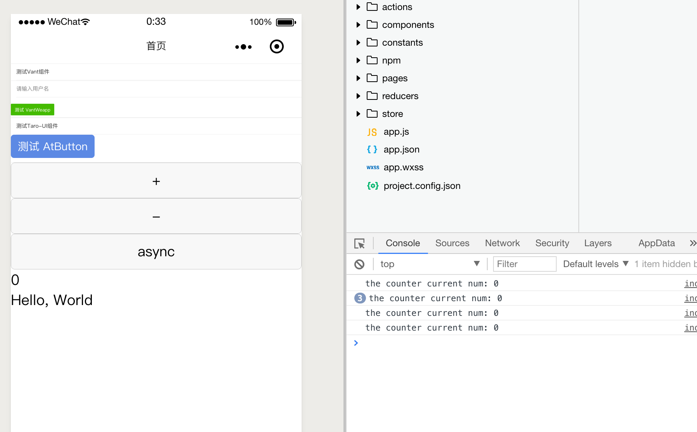

# taro-vant-dav
build with taro, vant-weapp

1. Taroa *^1.1.0-beta.2*
2. *Type Script*

整合有赞的组件库 `vant-weapp`。
可以做整合的示例。

Taro 官网地址: [https://github.com/NervJS/taro](https://github.com/NervJS/taro)

Vant-weapp文档地址:
[https://youzan.github.io/vant-weapp](https://youzan.github.io/vant-weapp)

## 安装Taro的新版本

1. 使用`taro init myApp`
2. 修改`package.json`中的taro相关包的版本号`*^1.1.0-beta.2`
3. 运行`npm install`


## 整合要点

1. 下载`vant-weapp/dist`保存在`src/components/vant-weapp/dist`
2. 在首页`index.jsx`中修改`usingComponents`,声明引入的组件
3. 在`render`方法中直接组件比如`van-button`

## lint

在`package.json`中增加`lint`脚本
```
"scripts":{
  "lint": "eslint --fix --ext .js,.vue,.jsx,.ts,.tsx src"
}
```

可以在`shell`窗口中执行如下命令
```
npm run lint
```

## 截图


